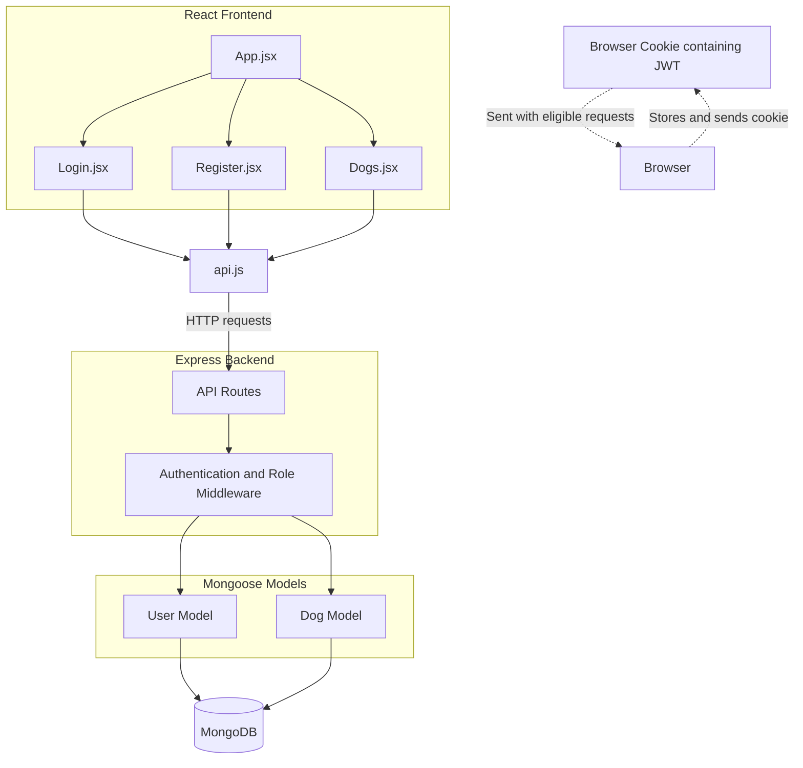

# Dogs API Architecture

This diagram shows the overall architecutre of the Dogs API. 

```mermaid
flowchart TB
    subgraph Frontend["React Frontend"]
        App["App.jsx"]
        Login["Login.jsx"]
        Register["Register.jsx"]
        Dogs["Dogs.jsx"]
    end

    Api["api.js"]

    subgraph Backend["Express Backend"]
        Routes["API Routes"]
        Auth["Authentication and Role Middleware"]
    end

    subgraph Models["Mongoose Models"]
        User["User Model"]
        Dog["Dog Model"]
    end

    DB[("MongoDB")]
    Cookie["Browser Cookie containing JWT"]

    App --> Login
    App --> Register
    App --> Dogs

    Login --> Api
    Register --> Api
    Dogs --> Api

    Api -->|"HTTP requests"| Routes
    Routes --> Auth
    Auth --> User
    Auth --> Dog

    User --> DB
    Dog --> DB

    Browser["Browser"]
    Browser -. "Stores and sends cookie" .-> Cookie
    Cookie -. "Sent with eligible requests" .-> Browser
```