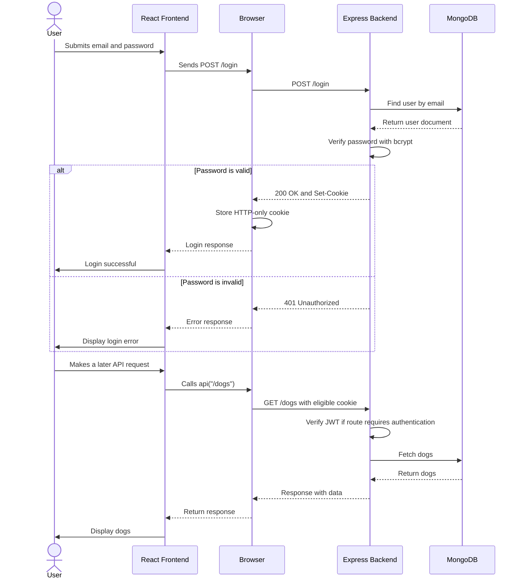

# Authentication and Login Flow

This diagram shows how login works and how the browser sends the authentication cookie with later requests.

```mermaid
sequenceDiagram
    actor User
    participant React as React Frontend
    participant Browser
    participant API as Express Backend
    participant DB as MongoDB

    User->>React: Submits email and password
    React->>Browser: Sends POST /login
    Browser->>API: POST /login
    API->>DB: Find user by email
    DB-->>API: Return user document
    API->>API: Verify password with bcrypt

    alt Password is valid
        API-->>Browser: 200 OK and Set-Cookie
        Browser->>Browser: Store HTTP-only cookie
        Browser-->>React: Login response
        React->>User: Login successful
    else Password is invalid
        API-->>Browser: 401 Unauthorized
        Browser-->>React: Error response
        React->>User: Display login error
    end

    User->>React: Makes a later API request
    React->>Browser: Calls api("/dogs")
    Browser->>API: GET /dogs with eligible cookie
    API->>API: Verify JWT if route requires authentication
    API->>DB: Fetch dogs
    DB-->>API: Return dogs
    API-->>Browser: Response with data
    Browser-->>React: Return response
    React->>User: Display dogs
```
